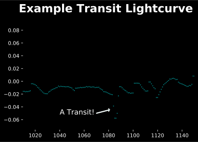

# Exoplanet Transit Detector!

### Details

The model was trained on ~5000 rows of data from the 3rd campaign of the K2 mission. It uses a
classification algorithm to detect probability of a transit. Currently, the model is able to produce:

* 100% TP
* 89.6% TN
* 10.4% FP
* 0% FN

This is achieved by using a modified threshold for positive class prediction. More details can be found inside the model file.
